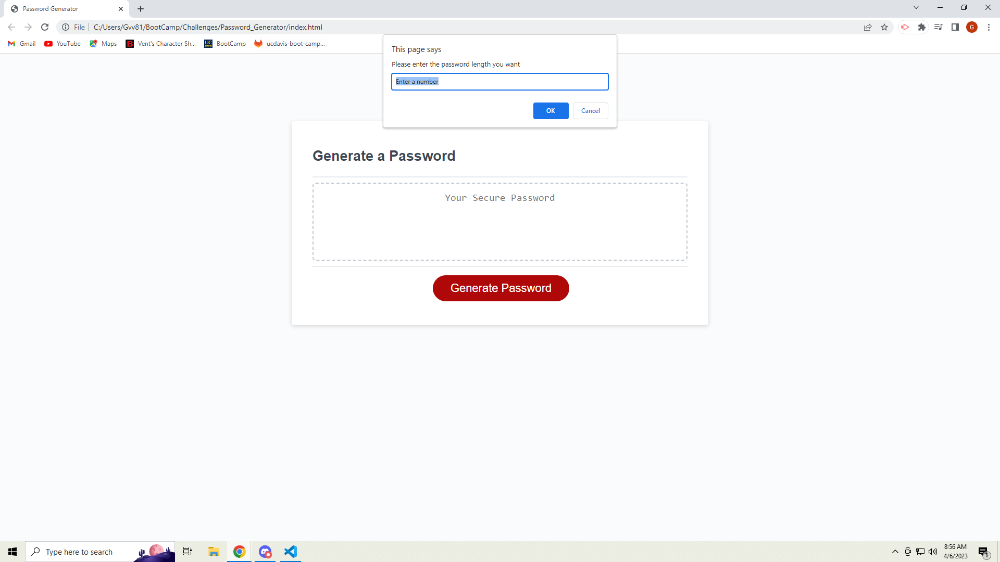
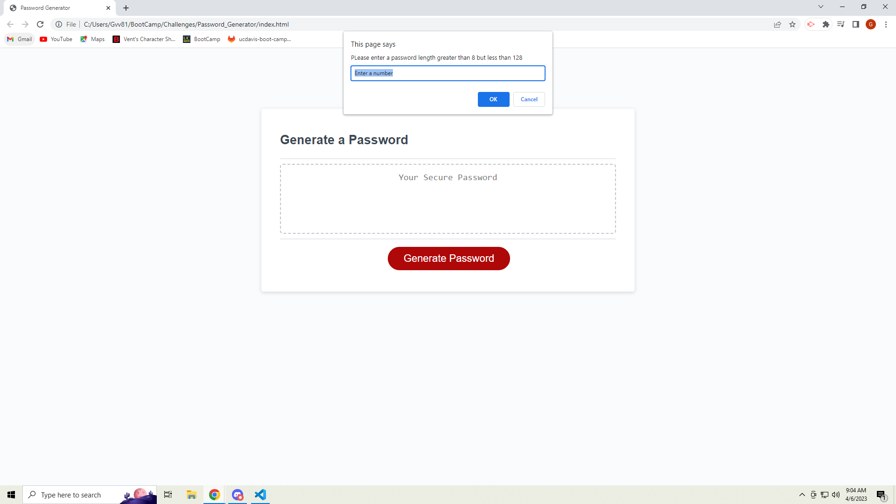
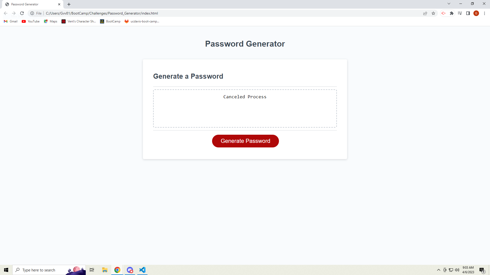
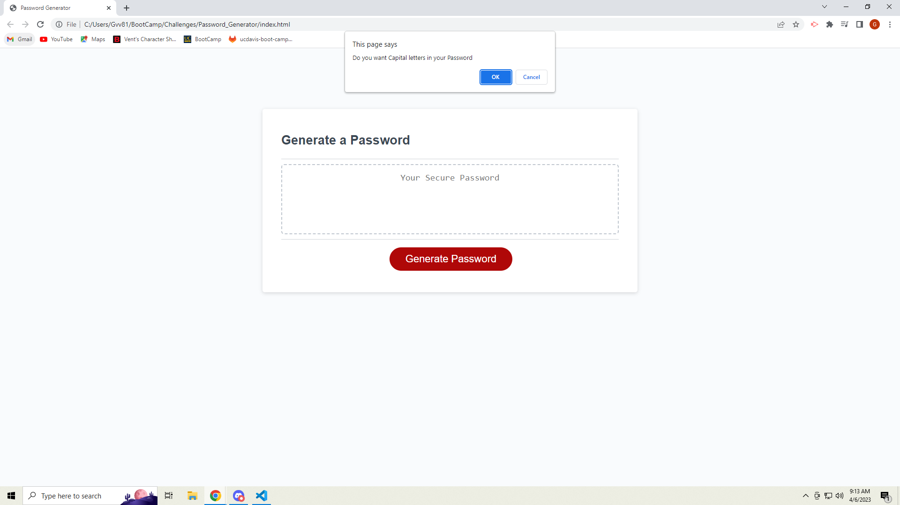
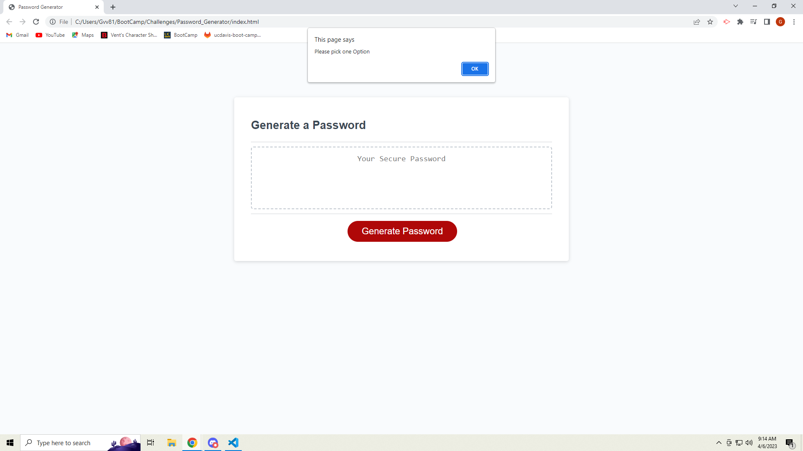

# Password Generator

# Description

I have been struggling to make passwords as of recently. I am never sure what to add while still having a strong or good password for new things I sign up for. This struggle has led to me making a password generator. I have been studying javaScript recently and this would be a good starting project. Looking at the issue the problem is generating a password. To accomplish this using java I will need to use a varity of different skills. The skills I will use include funcions, conditional statments, for loops, while loops, prompt, confirm, and alert. The project gave me better understanding on the prompt function and the other ones similar to it. This greater understanding led to me being able to respond to errors that could occur in my code. I also got to see type casting for the first time. Type casting made my life easier for this project. While type casting I got to see NaN too. I got this error a couple of times and it made me run though the whole password generation with a NaN password length. I thought you could catch the NaN by checking if NaN===NaN, but that was not the case though. NaN is always a falsy statement. Then my next challenge in the project was picking random characters for my password. I thought about making a bunch of arrays to do it but I remembered the char variable from other programing languages. I did some research that led me using a special string method called fromCharCode. Since I knew about ascii table, I knew about picking number between a range to get a random character. Special characters are an exception though because they are all over the ascii tabel which makes it harder to pick a special character. To make my life simpilar I made an array for the special character. The process of making a password was split into four functions. I learned about scope in javascript which led to me making globle varaibles. I had two different functions that used the same variables without having to pass them into the funtion. Near the end of the project I was undecided on the matter. I could have made an object to hold all the globle varables, but I did not do that. The preformance of my project is bad though because I could be extremly unlucky and get stuck in an infinite loop of a funtion calling a function. The way I chose a character could be made better for preformance. 

# Installation

N/A

# Usage

The password generator is a website with a single button which will trigger a series of pop-up windows. The image above is the webpage without pressing any buttons. Users will be able to click on the red button that says Generate Password. Once they do click on the button the first pop-up window asks users for a password length. Users can put something into the text area provided by the pop-up window.

The image above shows the first pop-up window. Now that we have this there is some error catching in this program. You must put a number or else the program will close assuming you want to cancel. Now if you want to a number less than 8 or greater than 128 you will be prompted to pick a number between those two options. 

Once we get a proper password length for our project you will recieve four confirm pop-up windows to ask what characters the user wants in their password. If the user hits no on all options the user will be alterted to pick one option out of the four options. Then the four confirm pop-up windows will appear one by one again. This will repeat if the user keeps pressing cancel on all options. 

Then after all of that users will get their randomly generated password. User will be able to highlight the password and copy it onto their clipboard. 

Here is a link to the webpage:

# License
Please refer to License in repo

# Credits

Thank you w3schools for help on different string methods and UFT-8 characters
fromCharCode: https://www.w3schools.com/jsref/jsref_fromcharcode.asp
UFT-8 Characters: https://www.w3schools.com/charsets/ref_utf_basic_latin.asp

Thank you mdn web docs for help on NaN and on prompt
Prompt: https://developer.mozilla.org/en-US/docs/Web/API/Window/prompt
NaN: https://developer.mozilla.org/en-US/docs/Web/JavaScript/Reference/Global_Objects/NaN
